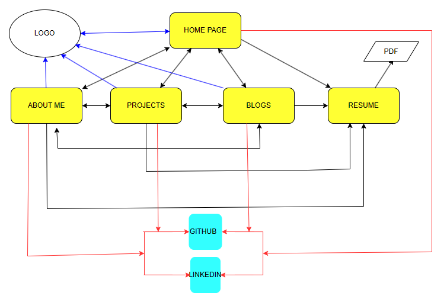

# Assessment-T1A2

## Author: John Rodriguez

[Published Portfolio Website](https://portafolio-five-red.vercel.app/)

[Github repository](https://github.com/JohnFaber2801/Assessment-T1A2)

[Slide Deck presentation](https://youtu.be/ehRp_iuQ7Mw)

## Purpose of Website

The main purpose of this website is to showcase to recruiters from the IT industry my skills, education, projects, blogs and contact details for hiring purposes.

## Funcionality / features

The portfolio website was designed for an easy navigational experience. First thing user will notice is my logo which will be the brand of my services. Then a navigation bar right under it where user can click on them for more information.

I added a picture of myself so the client can see who is dealing with. I believe I need to provide a sense of reliability and transparency from day one to build a long-lasting business relationship. I also added a small description of my services, contact details and social networks logos that will send the user directly to my socials profile.

- The navigation bar has a button named "resume" which will display my resume in PDF format so a potential client can download. The resume will contain more details about my work experience, education, projects, and references.

- 4 main pages, the navigation bar with 5 buttons including the one directing user to my resume and the logo always at the top of page that leads to the homepage are the main features of the website.

- Home will display my logo, navigation bar, my picture, introduction of my services and social media logos with their links.

- AboutMe will display my logo, a navigation bar, my professional background, education, my hard skills divided into sections (Scripting languages, Programming languages and Business analytical tools) and social media logos with their links.

- Projects will display my logo, navigation bar, one real project where I built an interactive dashboard, I gave an intro of it with button below the project image named View Project. user could go a see and interact with it. as well as social media with their links.

- Blog will display my logo, navigation bar, 5 blog articles and social media with their links.

- Resume will direct user to my resume. A shared link of my pdf resume. which can be download.

## Sitemap

 

- Find above a structure of all the pages. This will serve as a roadmap for better navigation through the website

## Screenshots

### Home page 

#### Mobile

#### Tablet

#### Desktop view.

### About Me

#### Mobile

*note*: 2 screenshot added as scroll down needed to explore all the content.

#### Tablet

*note:* 2 screenshot added as scroll down needed to explore all the content.

#### Desktop

### Project

#### Mobile

#### Tablet

#### Desktop

### Blog

#### Mobile

#### Tablet

*note:* 2 screenshot added as scroll down needed to explore all the content.

#### Desktop

*note:* 3 screenshot added as scroll down needed to explore all the content.

## Target Audience

The website portfolio is targeted to recruiters of the IT industry. It will bring access to real life projects and Github repositories. My diverse background will give an idea of what kink experience and person I am. My social media will help to support that.

## Tech Stack

* Website: HTML and CSS
* Wireframes and Sitemap: [draw.io](https://app.diagrams.net/)
* Logo: [LOGO.com](https://app.logo.com/)
* Icons: [Icons8.com](https://icons8.com)
* Deployment: [Vercel.com](https://vercel.com/dashboard)
* Resume : [wonsulting.com](https://www.wonsulting.com/)
* Slide deck: Powerpoint
* blog images: [unsplash.com](https://unsplash.com/)g